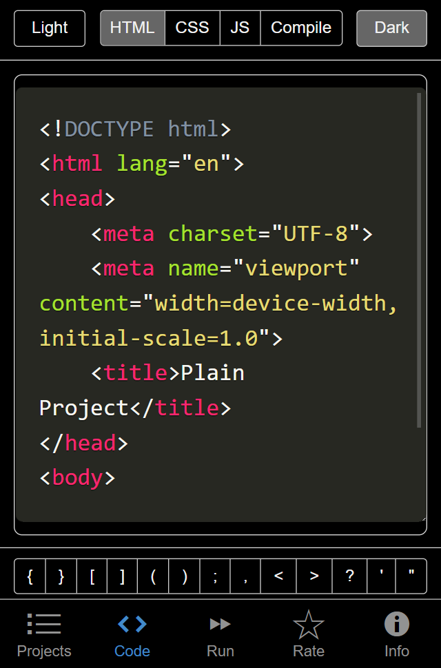

# MobilCoder
MobilCoder is free application that can edit HTML5, CSS3 and JavaScript and view it, all on mobile. BTW, you don't have to use pure JavaScript, you can use Typescript and/or React
## Features
<table>
  <tr><td></td><td></td></tr>
  <tr><td></td><td></td></tr>
